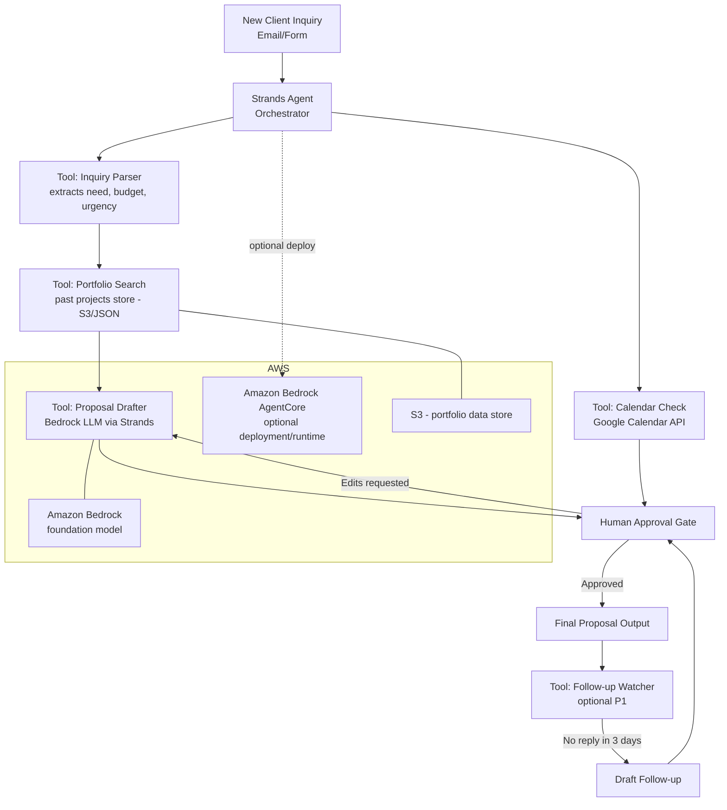

# FollowThrough

An agent that turns a new freelance client inquiry into a draft proposal
and suggested meeting times — in minutes, not days — while keeping a
human in control of everything that actually gets sent.

Built with the **AWS Strands Agents SDK** for the **Agents for Humans**
hackathon, Professional Agents track.

> This project was built during the Submission Period for the Agents for
> Humans Hackathon (Aug 10 – Sep 14, 2026).

## The problem

A new client inquiry sits in an inbox for 24–72 hours before a busy
freelancer finds time to read it, recall relevant past work, draft a
proposal, check their calendar, and propose meeting times. In that gap,
the prospect often books with a faster competitor.

FollowThrough closes that gap: it reads the inquiry, finds relevant past
work, drafts a proposal in the right tone, and proposes call times —
then stops and waits for the human to approve before anything is
considered final.

## How it works

1. **Parse** — extract what the client needs, budget signals, and urgency
   from the raw inquiry.
2. **Search** — look up 1–2 relevant past projects from a portfolio store.
3. **Draft** — write a proposal referencing the matched work, in a warm
   professional tone, without inventing pricing.
4. **Check calendar** — propose 3 open time slots for an intro call.
5. **Human approval gate** — present the draft + slots and wait. The
   agent never sends anything automatically.



*(Render this via GitHub's built-in Mermaid support, or export a PNG for
the submission's architecture-diagram requirement.)*

## Why the approval gate matters

Freelancers don't want an agent emailing clients unsupervised — a wrong
tone, a made-up price, or a fabricated project reference could cost a
relationship. FollowThrough always prepares; the human always decides.
This is a deliberate design choice, not a missing feature.

## Project structure

```
followthrough/
├── agent.py              # Strands agent + all P0 tools
├── portfolio.json         # Sample past-project records (edit with your own)
├── sample_inquiries/      # Example inquiries for testing/demo
│   ├── 01_clear.txt
│   ├── 02_vague.txt
│   └── 03_urgent.txt
├── README.md
└── LICENSE
```

## Setup

### 1. Prerequisites
- Python 3.10+
- An AWS account with a payment method and identity verification completed
- AWS credentials configured locally for the account (`aws configure`, or
  environment variables). FollowThrough uses **Amazon Nova Lite** in
  **us-east-1** — an Amazon-owned Bedrock model that does not require the
  separate Anthropic first-time use-case approval.

### 2. Install

```bash
python -m pip install -r requirements.txt
```

### 3. Configure AWS credentials

Install the AWS CLI if it is not installed, then run:

```bash
aws configure
```

Use the access key for an IAM user you create for local development, and set
its default region to `us-east-1`. Do not commit credentials to this repo.

### 4. Run

The project explicitly configures the Strands `BedrockModel` to use
`amazon.nova-lite-v1:0`, so it stays unblocked while Anthropic authorization
is pending.

```bash
python agent.py sample_inquiries/01_clear.txt
```

The agent will parse the inquiry, search `portfolio.json`, draft a
proposal, propose 3 call times (mocked for demo reliability — see
`check_calendar`), and then pause in your terminal for approval:

```
Approve this draft? [approve/revise]:
```

Type `approve` to finalize, or `revise` to give feedback and loop back.

### Optional: review dashboard

For a clearer demo-video experience, run the small human-review dashboard:

```bash
streamlit run app.py
```

It shows parsed signals, portfolio matches, suggested times, an editable Nova draft, and a visible approval gate. It never sends email.

### 5. Use your own data

Replace the entries in `portfolio.json` with summaries of your own past
projects (title, one-line summary, tags). No other code changes needed —
`search_portfolio` does keyword/tag matching against whatever is in the
file.

## Notes on scope (hackathon build)

- **Calendar and email are mocked** for demo-day reliability. Swapping
  `check_calendar` for a real Google Calendar freebusy query, and adding
  Gmail ingestion, are the natural next steps post-hackathon.
- **Not handling** contract negotiation, payment, or auto-sending —
  by design, not by omission.
- **Optional deployment**: this agent can be deployed via **Amazon
  Bedrock AgentCore Runtime** for a persistent, hosted version instead
  of running locally.

## Submission materials

- [Devpost submission draft](./submission/DEVPOST_SUBMISSION.md)
- [Five-minute demo-video script](./submission/DEMO_VIDEO_SCRIPT.md)
- [Final checklist](./submission/FINAL_CHECKLIST.md)

## License

MIT — see [LICENSE](./LICENSE).
